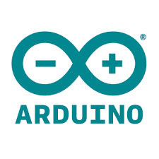

# NgrcPlatform

Customizable open source remote control using Web-Technologies

## Build with

## Introduction

This project is an IoT remote control which can send data from an Raspberry Pi over a 2.4GHz radio
transmitter to an Arduino. The Raspberry Pi is controlled via an DualShock 4 controller and hosts
a website which displays the current controller values and responses from the Arduino device. The
arduino can use the data to control (at the moment) up to 5 servo motors. The controls are highly
customizable, so that you can control cars, planes, drones, ships or whatever.

This library is an Nrwl/Nx workspace and contains several apps and libraries.

## Support by

