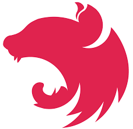
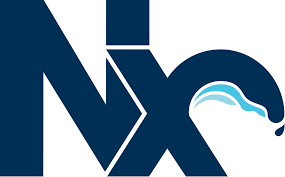

# NgrcPlatform

Customizable open source remote control using Web-Technologies

## Build with



## Introduction

This project is an IoT remote control which can send data from an Raspberry Pi over a 2.4GHz radio
transmitter to an Arduino. The Raspberry Pi is controlled via an DualShock 4 controller and hosts
a website which displays the current controller values and responses from the Arduino device. The
arduino can use the data to control (at the moment) up to 5 servo motors. The controls are highly
customizable, so that you can control cars, planes, drones, ships or whatever.

This library is an Nrwl/Nx workspace and contains several apps and libraries.

## Getting started

You can find detailed setup instructions on the docs. Clone the repository

```
git clone https://github.com/ngfelixl/ngrc-platform.git
```

Install all dependencies by

```
npm install
```

Start the development environment by

```
npm start
npm run start:server
```

Go to `https://localhost:4200`. You can add and configure your models. Note that the radio functionality
is not available in development mode. You need to set up the raspberry pi (webserver, radio communication)
and the arduino first.

## Support by

[](https://interfacewerk.de)